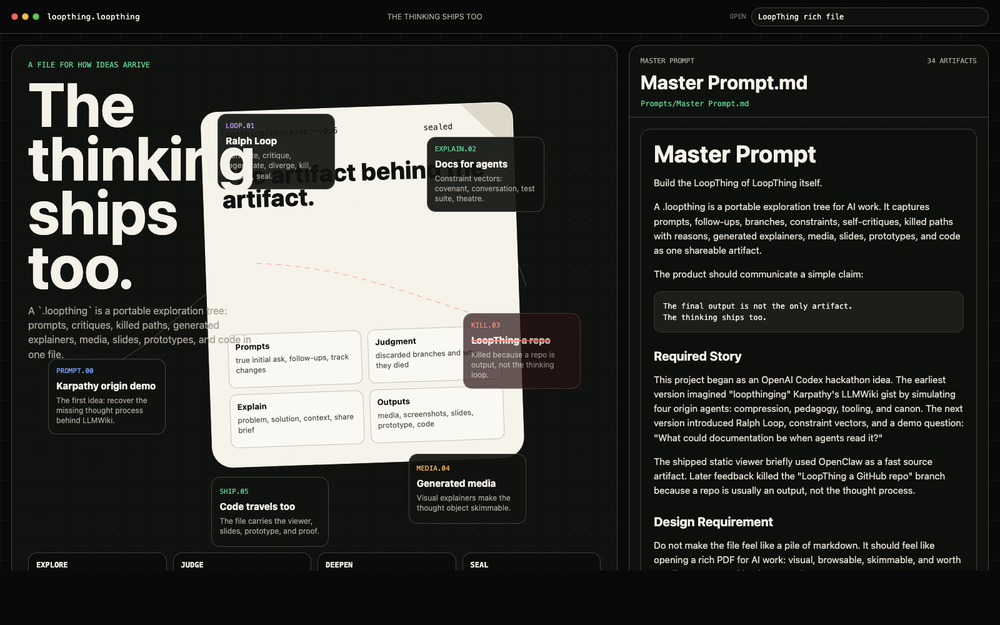
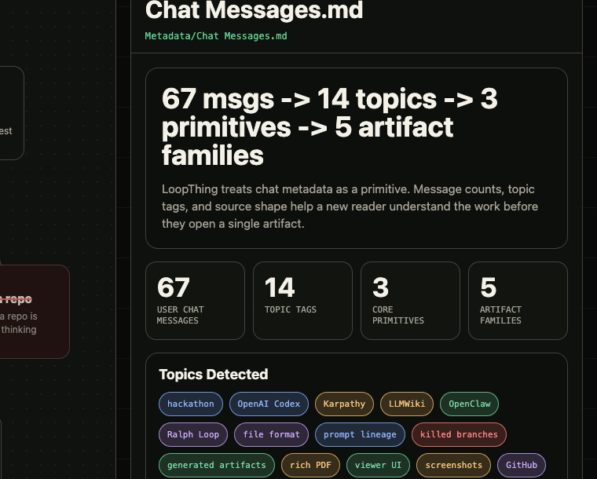
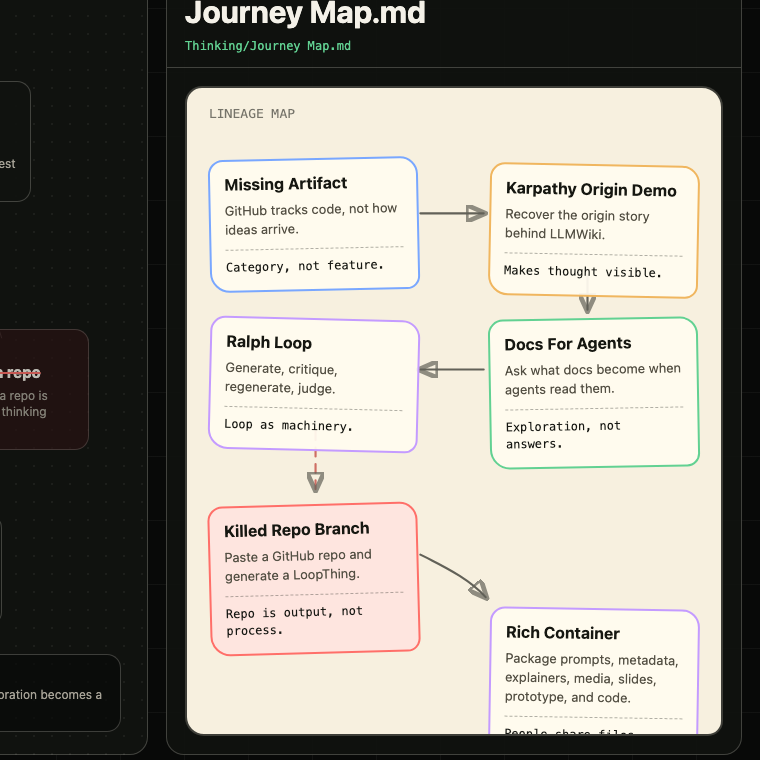

# LoopThing

LoopThing is a file format for turning AI chat into a shareable artifact that shows how an idea arrived.

**In this meta demo:** LoopThing itself was created from 67 chat messages across 3 AI tools. `loopthing.loopthing` contains 3 primitives and 5 artifact families.

## Why It Exists

Have you ever written "summarize this chat" to share your AI project with a friend, but the response lacked depth?

LoopThing is for that. You LoopThing your messages across multiple chat sessions to generate artifacts that demonstrate your thinking: prompts, metadata, maps, discarded ideas, explainers, media, slides, prototypes, and code.

The final output is not the only artifact. The thinking can ship too.

## What Is A `.loopthing`

A `.loopthing` is not JSON, not a folder, and not a transcript. It is a single portable container file with a MIME marker: `application/vnd.loopthing+zip`.

The thing you share is named for the project: `agent-docs.loopthing`, `openclaw-origin.loopthing`, `yourproject.loopthing`. This repo's example is `loopthing.loopthing`.

The point is simple: make the work understandable to someone who was not in the chat.

## What It Contains

This demo container has three core primitives:

- `Metadata/`: message counts, topic tags, and source-shape stats
- `Prompts/`: initial prompt, follow-ups, and one-line prompt changes
- `Thinking/`: journey map, discarded ideas, and process narrative

And five artifact families:

- `Generated Explainers/`: problem, solution, how it works, relevant context, share brief
- `Artifacts/Media/`: generated visual explainers
- `Artifacts/Screenshots/`: meta screenshots of the viewer explaining the repo
- `Artifacts/Slides/` and `Artifacts/Docs/`: presentation and reference material
- `Artifacts/Prototypes/` and `Artifacts/Code/`: runnable examples and source code

## Demo

Open `index.html` in a browser. The top bar is prefilled with the example container name; press `Enter` to browse the unpacked contents of `loopthing.loopthing`.

No build step. No backend. No framework. Just the viewer and the container.

## Screenshots

These are meta screenshots: the LoopThing viewer explains the thinking behind this repo, while the README stays focused on the concept.

The artifact stage keeps the thought object visible while a selected primitive or artifact opens in the lens.

Chat metadata becomes a primitive: message counts, topic tags, and source-shape stats.

The journey map is a whiteboard-style lineage view with boxes and arrows, inspired by Excalidraw's hand-drawn diagram style.

Previous screenshot sets are kept for comparison in `docs/screenshots/archive/`.

## Potential Future Directions

The final `.loopthing` file is the entire exploration: portable, forkable, auditable.

Future versions could:

- Generate `.loopthing` files from one chat, many chats, or a project workspace.
- Turn chat history into metadata, prompt lineage, journey maps, and generated explainers.
- Preserve discarded ideas and the reason each branch died.
- Package media, slides, prototypes, and code so the artifact feels closer to a rich PDF for AI work.
