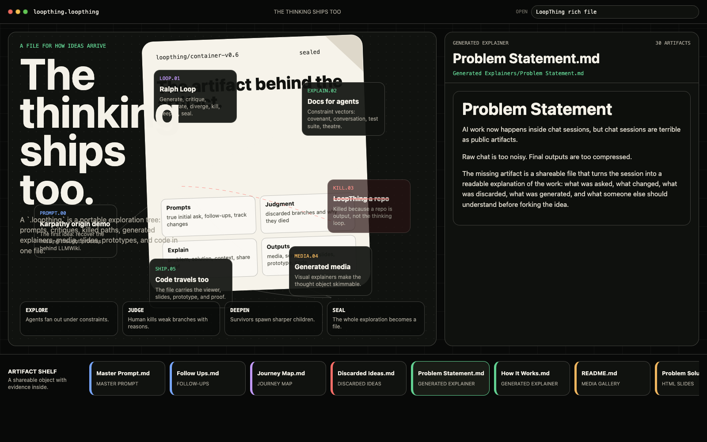

# LoopThing

LoopThing is a portable exploration tree for AI work: a `.loopthing` file captures the prompts, follow-ups, branches, self-critiques, killed paths, generated explainers, media, slides, prototypes, and code that show how an idea arrived.

Tagline: **The human is the loop**

## Why It Exists

AI work now starts in chat, but chat is a bad artifact.

Raw chat logs are too noisy to share. They include every false start, correction, formatting request, and half-formed turn. Final outputs have the opposite problem: they hide the decisions that made the work good.

LoopThing exists for the missing middle. It turns the messy loop of AI work into a portable file someone else can inspect, fork, audit, and learn from. The point is not "summarize my chat." The point is to generate the right artifacts so the thinking becomes readable: the problem statement, the constraints, the killed branches, the rationale, the visuals, the slides, the prototype, and the code.

Git tracks code. LoopThing tracks exploration.

## What Is A `.loopthing`

A `.loopthing` is not JSON, not a folder, and not a transcript. It is a single portable container file with a MIME marker: `application/vnd.loopthing+zip`.

This repo includes `loopthing-source/` only so GitHub can show the unpacked contents. The thing you share is `loopthing.loopthing`.

Inside this demo container:

- `Prompts/`: master prompt, true initial prompt, follow-ups, and the prompt change log
- `Thinking/`: process narrative, journey map, and discarded ideas with reasons
- `Drafts/`: rough framings that show the idea improving
- `Generated Explainers/`: problem statement, solution overview, how it works, relevant context, and share brief
- `Artifacts/Media/`: generated diagrams and visual explainers
- `Artifacts/Screenshots/`: screenshots that explain the viewer without running it
- `Artifacts/Slides/`: a small slide artifact
- `Artifacts/Prototypes/`: a working prototype artifact
- `Artifacts/Code/`: the viewer code artifact

## Ralph Loop

Ralph Loop is the technique. LoopThing is the artifact.

```text
EXPLORE -> JUDGE -> DEEPEN -> SEAL
```

An agent generates, critiques itself harshly, regenerates, diverges across siblings, and then the human kills weak branches with written reasons. A survivor can be deepened into another generation of branches. The sealed `.loopthing` preserves both the winning path and the rejected paths.

That is the core thesis: **pruned thought is evidence. The losing branch still teaches.**

## True Lineage

This project began as an OpenAI Codex hackathon idea.

The first demo concept was built around Andrej Karpathy's LLMWiki gist: simulate the missing thought process behind a finished artifact, with four origin agents such as compression, pedagogy, tooling, and canon.

The demo script then sharpened into a product idea: a Ralph Loop exploration around the question, "What could documentation be when agents read it?" Four agents would fan out under constraint vectors: covenant, conversation, test suite, and theatre. The human would judge, kill, deepen, and seal the final `.loopthing`.

The live repo then pivoted to an OpenClaw viewer because it could be built quickly as a static hackathon demo. Later feedback killed the "LoopThing a GitHub repo" direction. A repo is usually an output of the thinking process, not the process itself.

The current version is the LoopThing of LoopThing: a rich portable file generated from this conversation, containing the prompt spine, discarded ideas, generated explainers, media, screenshots, slides, prototype, and code.

## Demo

Open `index.html` in a browser. The top bar is prefilled with the LoopThing container name; press `Enter` to browse the unpacked contents of `loopthing.loopthing`.

No build step. No backend. No framework. Just the viewer and the container.

## Screenshots

The viewer starts as an artifact stage: the thought loop stays visible while the selected prompt, media object, explainer, slide, prototype, or code artifact opens in the lens.


The prompt spine now includes the real earlier context: Karpathy, LLMWiki, Ralph Loops, constraint vectors, OpenClaw, and the killed repo-input branch.


The journey map shows the idea moving through EXPLORE, JUDGE, DEEPEN, and SEAL instead of presenting a vague graph.


Media is first-class in the container. A `.loopthing` should feel closer to a rich PDF with code and provenance than a directory of markdown files.


Generated explainers turn the chat session into context that a coworker, judge, or future collaborator can skim.



The same container can carry working artifacts such as slides, prototypes, and the viewer code.


## What This Repo Shows

The static viewer renders a `.loopthing` as an artifact stage: the loop stays visible while each prompt, killed branch, media object, explainer, slide, prototype, or code artifact opens in a lens.

This demo intentionally includes multiple media types so the artifact does not collapse into "a bunch of markdown":

- Markdown prompts and explanations
- SVG visual explainers
- PNG screenshots
- HTML slides
- HTML prototype
- HTML/CSS/JS viewer code
- Zip-style `.loopthing` container

## Container Format

The example `.loopthing` is a real single-file archive:

```text
loopthing.loopthing
loopthing-source/
  mimetype
  manifest.loop
  Prompts/
  Thinking/
  Drafts/
  Generated Explainers/
  Artifacts/
    Media/
    Screenshots/
    Docs/
    Slides/
    Prototypes/
    Code/
```

The artifact can contain structured graph data, but the product promise is bigger than graph storage. It packages the generated context someone needs to inherit the work.

## Notes

This is still a static demo of generated output, not a live multi-agent runtime. The intended product flow is:

```text
loopthing explore "<brief>" --canonical=documentation.loopthing
loopthing view ./agent-docs.loopthing
loopthing kill node-003 --reason "Too close to existing docs portals"
loopthing deepen node-002
loopthing seal
```

The final file is the entire exploration: portable, forkable, auditable.
