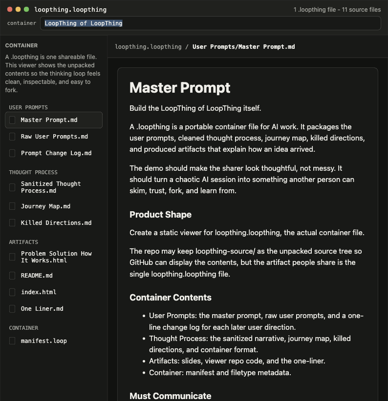
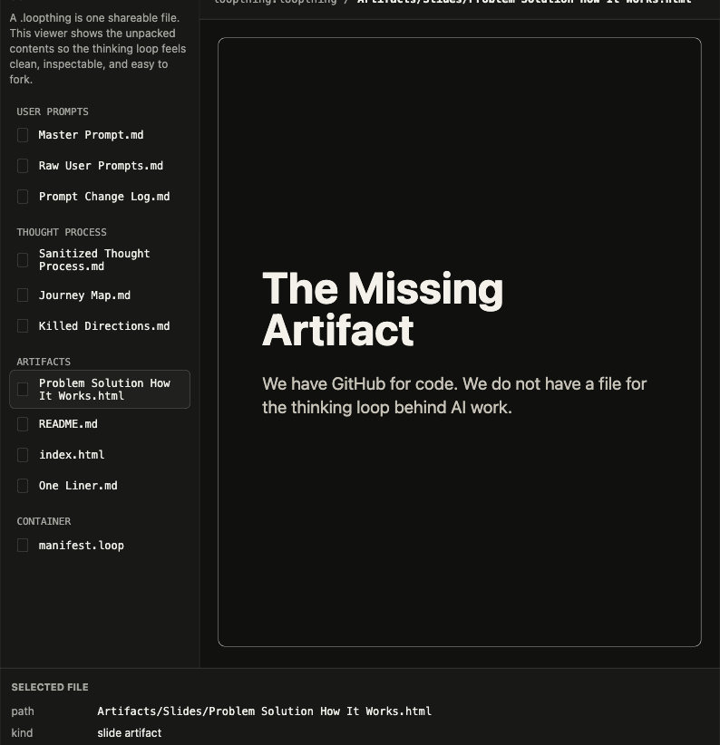
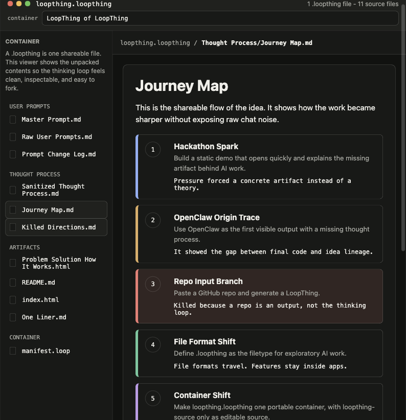
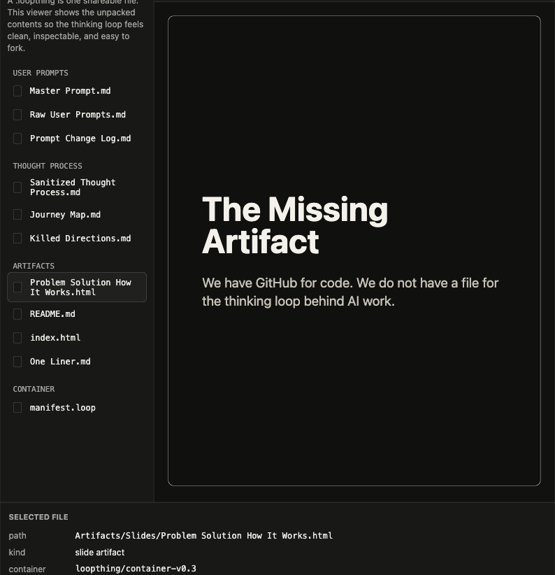
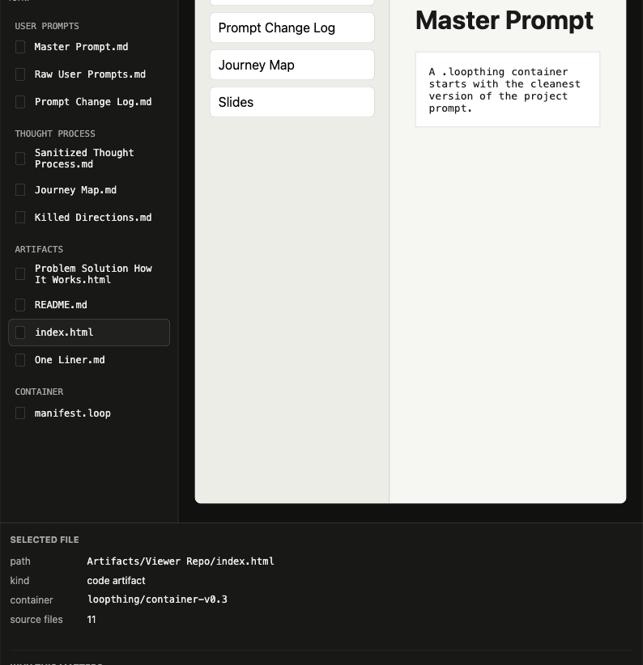

# LoopThing

LoopThing is a portable container file for AI work: a forkable, auditable collection of the user prompts, decisions, killed branches, journey map, and artifacts behind how an idea arrived.

It is not just a chat summary. It is a portable artifact for exploratory work: the cleaned-up prompt trail, the branches that mattered, the ideas that were killed, the reasons they were killed, and the outputs that came out of the session.

Git tracks code diffs. LoopThing packages thinking loops.

This example began as an OpenAI Codex hackathon demo. It went through several revisions, including a GitHub-repo input version, before landing on the current idea: you do not LoopThing a repo; you LoopThing the exploratory AI session that produced the repo, slides, docs, code, and decisions.

## What Is In This Repo

- `index.html` is the vanilla JS viewer. No build step, backend, framework, login, or install.
- `loopthing.loopthing` is the actual portable container file. It is a zip-style filetype with the MIME marker `application/vnd.loopthing+zip`.
- `loopthing-source/` is the unpacked editing source for that container, included so GitHub can show the contents.
- `openclaw.loopthing` is an earlier reverse-engineered origin trace for Peter Steinberger's OpenClaw project.
- `PROMPT.md` is the refined build prompt distilled from feedback.

## Demo

Open `index.html` in a browser. The top bar is prefilled with the LoopThing container name; press `Enter` to browse the unpacked contents of `loopthing.loopthing`.

## Screenshots

The viewer opens a `.loopthing` as one portable container, with the master prompt as the entrypoint.



User prompts are the spine: raw prompt excerpts plus one-line summaries of later meta-level changes.



The journey map replaces the esoteric graph file with a readable flow of how the idea became sharper.



Generated artifacts travel inside the container too, including slides that explain the problem, solution, and how it works.



The container can also carry working code artifacts, like the tiny viewer repo included here.



## What It Shows

The viewer renders a `.loopthing` container like a tiny file OS:

- `User Prompts/Master Prompt.md`
- `User Prompts/Raw User Prompts.md`
- `User Prompts/Prompt Change Log.md`
- `Thought Process/Sanitized Thought Process.md`
- `Thought Process/Journey Map.md`
- `Thought Process/Killed Directions.md`
- `Artifacts/Slides/Problem Solution How It Works.html`
- `Artifacts/Viewer Repo/`

The core entrypoint is the master prompt. The prompt files show how the user's directions changed over time, including killed ideas and the reasons they were killed.

The lineage explicitly captures the OpenAI Codex hackathon origin, the OpenClaw demo phase, the killed GitHub-repo direction, and the subsequent user-input summaries from this chat thread.

## Why It Exists

Modern AI work starts in chat. That chat becomes the primitive: prompts, follow-ups, discarded ideas, rough drafts, screenshots, docs, slides, prototypes, and code.

Today those loops either stay as unreadable session history or get compressed into a final artifact where the useful process disappears. LoopThing turns that session mess into something readable, skimmable, and safe to share.

## Container Format

The example `.loopthing` is a single container file. The repo includes `loopthing-source/` only so the contents are readable in GitHub:

```text
loopthing.loopthing
loopthing-source/
  mimetype
  manifest.loop
  User Prompts/
    Master Prompt.md
    Raw User Prompts.md
    Prompt Change Log.md
  Thought Process/
    Sanitized Thought Process.md
    Journey Map.md
    Killed Directions.md
    Container Format.md
  Artifacts/
    Slides/Problem Solution How It Works.html
    Viewer Repo/
    One Liner.md
```

The `.loopthing` can contain structured data, but it is not JSON and it is not a folder. It is a portable container for the thinking loop and its artifacts.

## Notes

This is a static demo artifact, not a generator. The MVP idea is sanitized inputs first: preserve the human prompt trail and artifact references as the canonical proof, rather than dumping raw AI responses.
