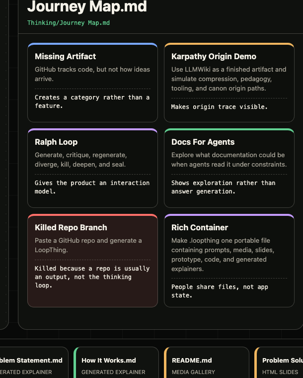
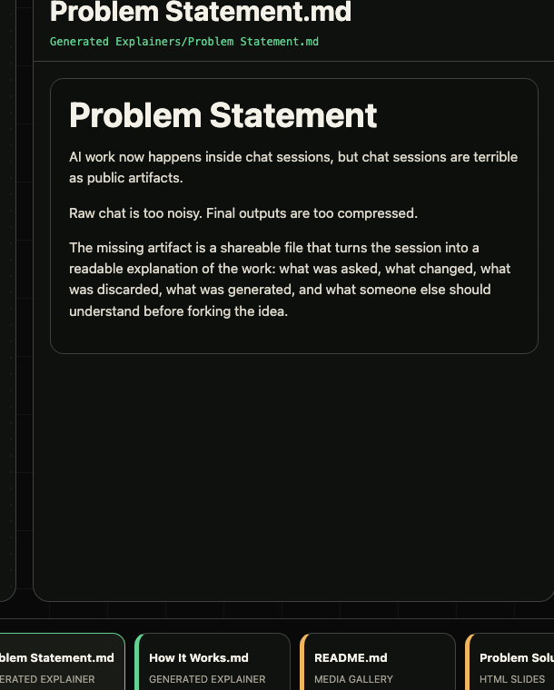

# LoopThing

LoopThing is a portable exploration tree for AI work. You LoopThing your chat session, sessions, or project to generate artifacts that demonstrate the thinking behind the work: prompts, follow-ups, branches, self-critiques, killed paths, generated explainers, media, slides, prototypes, and code.

Tagline: **The human is the loop**

## Why It Exists

AI work now starts in chat, but chat is a bad artifact.

Raw chat logs are too noisy to share. They include every false start, correction, formatting request, and half-formed turn. Final outputs have the opposite problem: they hide the decisions that made the work good.

LoopThing exists for the missing middle. It turns the messy loop of AI work into a portable file someone else can inspect, fork, audit, and learn from. The point is not "summarize my chat." The point is to generate the right artifacts so the thinking becomes readable: the problem statement, the constraints, the killed branches, the rationale, the visuals, the slides, the prototype, and the code.

Git tracks code. LoopThing tracks exploration.

## What Is A `.loopthing`

A `.loopthing` is not JSON, not a folder, and not a transcript. It is a single portable container file with a MIME marker: `application/vnd.loopthing+zip`.

This repo includes `loopthing-source/` only so GitHub can show the unpacked contents. The thing you share is a project-specific container such as `agent-docs.loopthing`, `openclaw-origin.loopthing`, or `yourproject.loopthing`. In this repo, the example container is `loopthing.loopthing`.

Inside this demo container:

- `Prompts/`: master prompt, true initial prompt, follow-ups, and the prompt change log
- `Thinking/`: process narrative, journey map, and discarded ideas with reasons
- `Drafts/`: rough framings that show the idea improving
- `Generated Explainers/`: problem statement, solution overview, how it works, relevant context, and share brief
- `Artifacts/Media/`: generated diagrams and visual explainers
- `Artifacts/Screenshots/`: screenshots that explain the viewer without running it
- `Artifacts/Slides/`: a small slide artifact
- `Artifacts/Prototypes/`: a working prototype artifact
- `Artifacts/Code/`: the viewer code artifact

## Ralph Loop

Ralph Loop is not the product headline here. It is a useful background process for generating the artifacts inside a `.loopthing`.

```text
EXPLORE -> JUDGE -> DEEPEN -> SEAL
```

In this context, a Ralph Loop means an agent generates, critiques itself, regenerates with fresh context, uses feedback, and repeats until the artifact set is good enough to seal. The name references [`snarktank/ralph`](https://github.com/snarktank/ralph), an autonomous AI coding loop where fresh AI instances repeatedly work through PRD items, persist learnings, and use feedback checks.

LoopThing uses that looping idea as generation machinery. The sealed `.loopthing` is the shareable artifact that preserves the winning path, the rejected paths, and the generated context.

That is the core thesis: **pruned thought is evidence. The losing branch still teaches.**

## True Lineage

This project began as an OpenAI Codex hackathon idea.

The first demo concept was built around Andrej Karpathy's LLMWiki gist: simulate the missing thought process behind a finished artifact, with four origin agents such as compression, pedagogy, tooling, and canon.

The demo script then sharpened into a product idea: a Ralph Loop exploration around the question, "What could documentation be when agents read it?" Four agents would fan out under constraint vectors: covenant, conversation, test suite, and theatre. The human would judge, kill, deepen, and seal the final `.loopthing`.

The early live repo then tried to understand the thinking process behind what Peter Steinberger was building with OpenClaw by working backward from the repo. That helped ship a static viewer fast, but it was the wrong long-term center of gravity. A repo is usually an output of the thinking process, not the process itself.

The current version is the LoopThing of LoopThing: a rich portable file generated from this conversation, containing the prompt spine, discarded ideas, generated explainers, media, screenshots, slides, prototype, and code.

## Demo

Open `index.html` in a browser. The top bar is prefilled with the LoopThing container name; press `Enter` to browse the unpacked contents of `loopthing.loopthing`.

No build step. No backend. No framework. Just the viewer and the container.

## Screenshots

These are meta screenshots of the LoopThing viewer explaining this repo: why the artifact exists, how the idea changed, and what context a `.loopthing` generates for someone new.

The artifact stage keeps the thought object visible while a selected prompt, decision, explainer, slide, prototype, or code artifact opens in the lens.


The journey map is the readable lineage: hackathon idea, Karpathy origin demo, Ralph Loop, OpenClaw detour, killed repo branch, and the richer container direction.



Generated explainers turn the chat session into context that a coworker, judge, or future collaborator can understand quickly.



Previous screenshot sets are kept for comparison in `docs/screenshots/archive/`.

## What This Repo Shows

The static viewer renders a `.loopthing` as an artifact stage: the loop stays visible while each prompt, killed branch, media object, explainer, slide, prototype, or code artifact opens in a lens.

This demo intentionally includes multiple media types so the artifact does not collapse into "a bunch of markdown":

- Markdown prompts and explanations
- SVG visual explainers
- PNG screenshots
- HTML slides
- HTML prototype
- HTML/CSS/JS viewer code
- Zip-style `.loopthing` container

## Container Format

The example `.loopthing` is a real single-file archive:

```text
loopthing.loopthing
loopthing-source/
  mimetype
  manifest.loop
  Prompts/
  Thinking/
  Drafts/
  Generated Explainers/
  Artifacts/
    Media/
    Screenshots/
    Docs/
    Slides/
    Prototypes/
    Code/
```

The artifact can contain structured graph data, but the product promise is bigger than graph storage. It packages the generated context someone needs to inherit the work.

## Potential Future Directions

The final `.loopthing` file is the entire exploration: portable, forkable, auditable.

This repo is still a static demo of generated output, not a live multi-agent runtime. The higher-level direction is:

- Generate `.loopthing` files from one chat, many chats, or a project workspace.
- Produce useful artifacts automatically: problem statements, decision maps, literature/context notes, slides, screenshots, prototypes, and code references.
- Let humans judge and preserve killed branches with reasons.
- Make the result feel like a modern rich PDF for AI work: portable, visual, inspectable, and worth sending to another person.

A future product flow could look like:

```text
loopthing explore "<brief>" --canonical=documentation.loopthing
loopthing view ./agent-docs.loopthing
loopthing kill node-003 --reason "Too close to existing docs portals"
loopthing deepen node-002
loopthing seal
```
